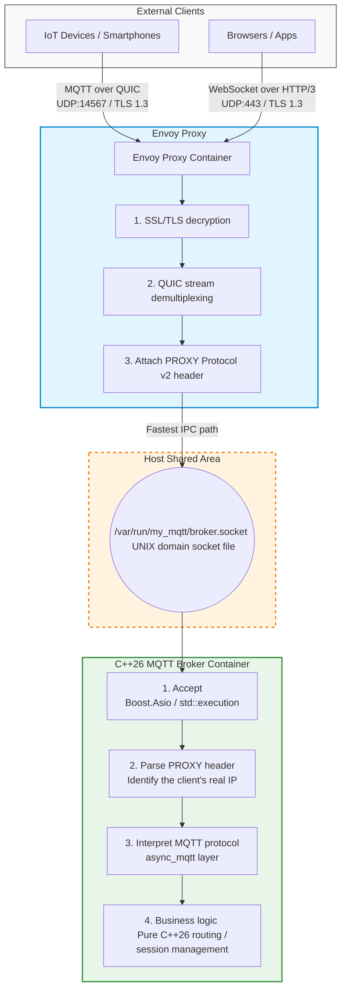
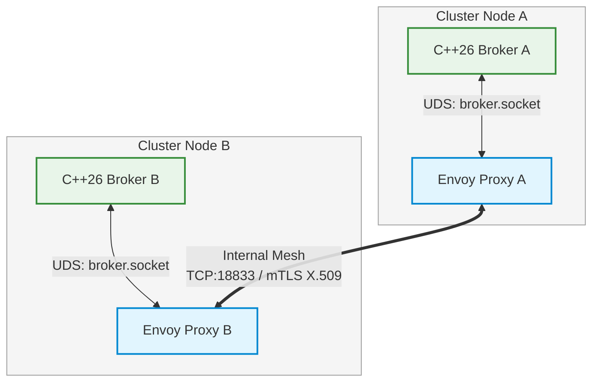
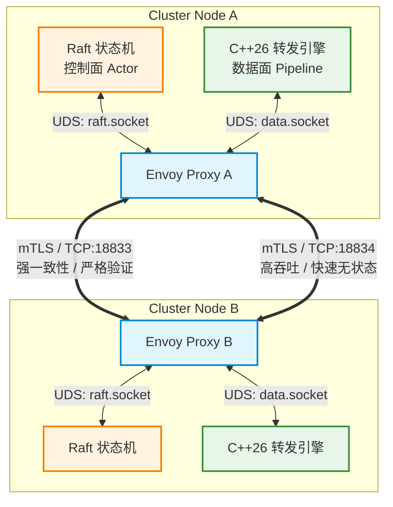
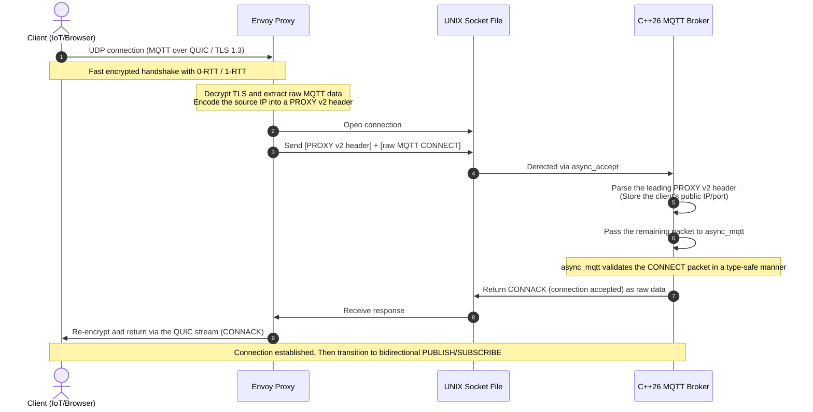
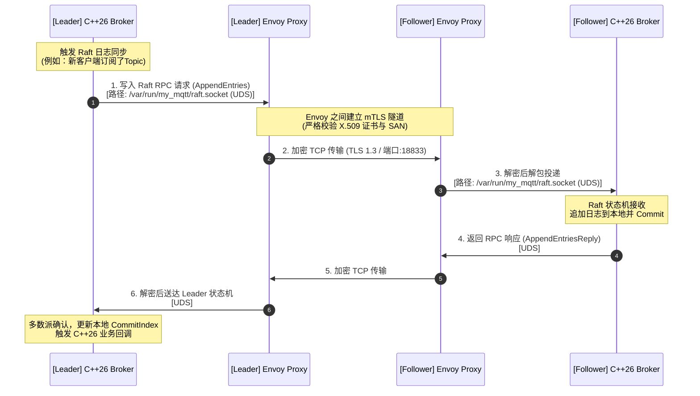
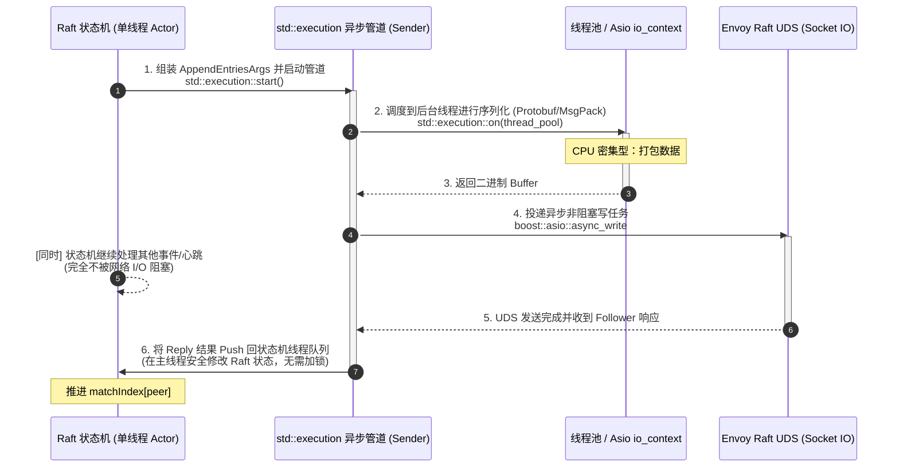
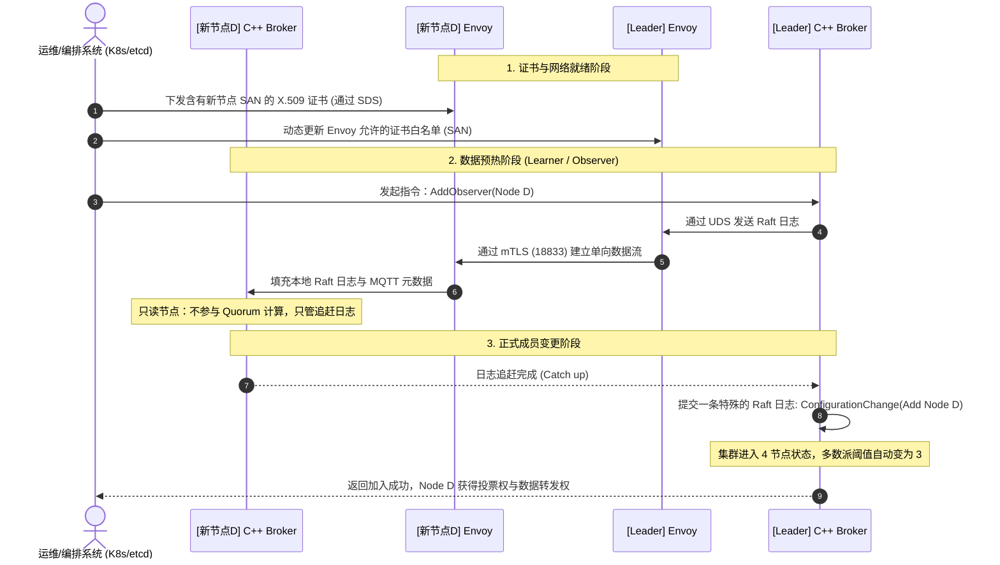
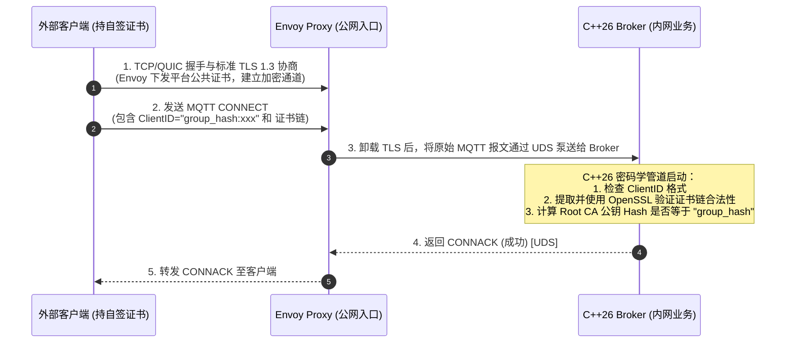

# otmc.broker
OTMC MQTT Broker
### 项目介绍
#### 整体构建

### 集群架构


### 架构双轨制：控制面 vs 数据面



#### 连接时序图


#### 集群同期时序图 跨节点 Raft 同步整体时序图（网络与安全视角）

#### 集群同期时序图 Leader 内部 C++26 std::execution 异步流水线时序图


### 新节点加入控制面的标准时序（结合 Envoy mTLS）


## 配置文件
### Envoy 核心配置文件 (envoy.yaml)
```yaml
static_resources:
  listeners:
    # =========================================================================
    # 外部客户端接入 1：物联网设备通过 MQTT over QUIC 接入 (UDP: 14567)
    # =========================================================================
    - name: external_mqtt_quic_listener
      address:
        socket_address:
          protocol: UDP
          address: 0.0.0.0
          port_value: 14567
      udp_listener_config:
        quic_options: {}  # 开启 QUIC 监听器
      filter_chains:
        - filters:
            - name: envoy.filters.network.tcp_proxy
              typed_config:
                "@type": type.googleapis.com/envoy.extensions.filters.network.tcp_proxy.v3.TcpProxy
                stat_prefix: external_quic_proxy
                cluster: local_mqtt_broker_uds_main  # 转发到本地 Broker 主接入 UDS
          transport_socket:
            name: envoy.transport_sockets.quic
            typed_config:
              "@type": type.googleapis.com/envoy.extensions.transport_sockets.quic.v3.DownstreamQuicContext
              common_tls_context:
                tls_certificates:
                  - certificate_chain: { filename: "/etc/envoy/certs/mqtt_domain.crt" } # 外部域名证书
                    private_key: { filename: "/etc/envoy/certs/mqtt_domain.key" }
                alpn_protocols: ["mqt-quic"] # 声明 MQTT over QUIC 协议标识

    # =========================================================================
    # 外部客户端接入 2：现代 App/浏览器通过 WebSocket over HTTP/3 接入 (UDP: 443)
    # =========================================================================
    - name: external_websocket_h3_listener
      address:
        socket_address:
          protocol: UDP
          address: 0.0.0.0
          port_value: 443
      udp_listener_config:
        quic_options: {}
      filter_chains:
        - filters:
            - name: envoy.filters.network.http_connection_manager
              typed_config:
                "@type": type.googleapis.com/envoy.extensions.filters.network.http_connection_manager.v3.HttpConnectionManager
                stat_prefix: external_ws_h3_ingress
                codec_type: HTTP3
                http3_protocol_options: {}
                route_config:
                  name: websocket_route
                  virtual_hosts:
                    - name: mqtt_ws_host
                      domains: ["*"]
                      routes:
                        - match: { prefix: "/mqtt" } # 匹配 WebSocket 握手路径
                          route:
                            cluster: local_mqtt_broker_uds_main
                            upgrade_configs:
                              - upgrade_type: websocket # 开启并允许 WebSocket 升级
                http_filters:
                  - name: envoy.filters.http.router
                    typed_config:
                      "@type": type.googleapis.com/envoy.extensions.filters.http.router.v3.Router
          transport_socket:
            name: envoy.transport_sockets.quic
            typed_config:
              "@type": type.googleapis.com/envoy.extensions.transport_sockets.quic.v3.DownstreamQuicContext
              common_tls_context:
                tls_certificates:
                  - certificate_chain: { filename: "/etc/envoy/certs/mqtt_domain.crt" }
                    private_key: { filename: "/etc/envoy/certs/mqtt_domain.key" }

    # =========================================================================
    # 内部控制面：拦截本地 C++ Broker 的 Raft RPC 流量 (IPC)
    # =========================================================================
    - name: raft_local_uds_listener
      address:
        pipe: { path: "/var/run/my_mqtt/raft.socket", mode: 0666 }
      filter_chains:
        - filters:
            - name: envoy.filters.network.tcp_proxy
              typed_config:
                "@type": type.googleapis.com/envoy.extensions.filters.network.tcp_proxy.v3.TcpProxy
                stat_prefix: raft_upstream_proxy
                cluster: raft_cluster

    # =========================================================================
    # 内部数据面：拦截本地 C++ Broker 的跨节点转发流量 (IPC)
    # =========================================================================
    - name: data_local_uds_listener
      address:
        pipe: { path: "/var/run/my_mqtt/cluster_data.socket", mode: 0666 }
      filter_chains:
        - filters:
            - name: envoy.filters.network.tcp_proxy
              typed_config:
                "@type": type.googleapis.com/envoy.extensions.filters.network.tcp_proxy.v3.TcpProxy
                stat_prefix: data_upstream_proxy
                cluster: data_cluster

    # =========================================================================
    # 集群互连入站：接收远端 Raft 节点请求 (mTLS 18833)
    # =========================================================================
    - name: raft_mesh_ingress_listener
      address: { socket_address: { address: 0.0.0.0, port_value: 18833 } }
      filter_chains:
        - filters:
            - name: envoy.filters.network.tcp_proxy
              typed_config:
                "@type": type.googleapis.com/envoy.extensions.filters.network.tcp_proxy.v3.TcpProxy
                stat_prefix: raft_ingress_proxy
                cluster: local_raft_broker_uds
          transport_socket: &internal_mtls_downstream
            name: envoy.transport_sockets.tls
            typed_config:
              "@type": type.googleapis.com/envoy.extensions.transport_sockets.tls.v3.DownstreamTlsContext
              common_tls_context:
                tls_certificates:
                  - certificate_chain: { filename: "/etc/envoy/certs/node.crt" } # 集群节点内部证书
                    private_key: { filename: "/etc/envoy/certs/node.key" }
                validation_context:
                  trusted_ca: { filename: "/etc/envoy/certs/ca.crt" }
                  match_typed_subject_alt_names:
                    - san_type: DNS
                      matcher: { exact: "broker-cluster.internal" }

    # =========================================================================
    # 集群互连入站：接收远端数据面同步请求 (mTLS 18834)
    # =========================================================================
    - name: data_mesh_ingress_listener
      address: { socket_address: { address: 0.0.0.0, port_value: 18834 } }
      filter_chains:
        - filters:
            - name: envoy.filters.network.tcp_proxy
              typed_config:
                "@type": type.googleapis.com/envoy.extensions.filters.network.tcp_proxy.v3.TcpProxy
                stat_prefix: data_ingress_proxy
                cluster: local_data_broker_uds
          transport_socket: *internal_mtls_downstream

  # =========================================================================
  # Upstream Clusters 转发目标定义
  # =========================================================================
  clusters:
    # 🎯 核心变更：外部客户端流量的物理去向，添加 PROXY Protocol v2 头部
    - name: local_mqtt_broker_uds_main
      connect_timeout: 0.25s
      type: STATIC
      load_assignment:
        cluster_name: local_mqtt_broker_uds_main
        endpoints:
          - lb_endpoints:
              - endpoint:
                  address:
                    pipe: { path: "/var/run/my_mqtt/broker.socket" } # 对应首图的主入口 UDS
      transport_socket:
        name: envoy.transport_sockets.upstream_proxy_protocol
        typed_config:
          "@type": type.googleapis.com/envoy.extensions.transport_sockets.proxy_protocol.v3.UpstreamProxyProtocol
          # 核心包裹：把客户端真实 IP 封装进 PROXY v2 格式传给 C++ Broker
          allow_missing_proxy_protocol: false
          transport_socket:
            name: envoy.transport_sockets.raw_buffer
            typed_config:
              "@type": type.googleapis.com/envoy.extensions.transport_sockets.raw_buffer.v3.RawBuffer

    # 远端集群节点控制面 (Raft Mesh - Upstream)
    - name: raft_cluster
      connect_timeout: 1s
      type: STRICT_DNS
      dns_lookup_family: V4_ONLY
      lb_policy: ROUND_ROBIN
      load_assignment:
        cluster_name: raft_cluster
        endpoints:
          - lb_endpoints:
              - endpoint: { address: { socket_address: { address: "node-b.internal", port_value: 18833 } } }
              - endpoint: { address: { socket_address: { address: "node-c.internal", port_value: 18833 } } }
      transport_socket: &internal_mtls_upstream
        name: envoy.transport_sockets.tls
        typed_config:
          "@type": type.googleapis.com/envoy.extensions.transport_sockets.tls.v3.UpstreamTlsContext
          common_tls_context:
            tls_certificates:
              - certificate_chain: { filename: "/etc/envoy/certs/node.crt" }
                private_key: { filename: "/etc/envoy/certs/node.key" }
            validation_context:
              trusted_ca: { filename: "/etc/envoy/certs/ca.crt" }

    # 远端集群节点数据面 (Data Mesh - Upstream)
    - name: data_cluster
      connect_timeout: 0.5s
      type: STRICT_DNS
      dns_lookup_family: V4_ONLY
      lb_policy: ROUND_ROBIN
      load_assignment:
        cluster_name: data_cluster
        endpoints:
          - lb_endpoints:
              - endpoint: { address: { socket_address: { address: "node-b.internal", port_value: 18834 } } }
              - endpoint: { address: { socket_address: { address: "node-c.internal", port_value: 18834 } } }
      transport_socket: *internal_mtls_upstream

    # 转发给本地 C++ Broker 的本地接收端定义（无 PROXY 头部，供集群内部互连使用）
    - name: local_raft_broker_uds
      connect_timeout: 0.25s
      type: STATIC
      load_assignment:
        cluster_name: local_raft_broker_uds
        endpoints:
          - lb_endpoints:
              - endpoint: { address: { pipe: { path: "/var/run/my_mqtt/raft.socket" } } }

    - name: local_data_broker_uds
      connect_timeout: 0.25s
      type: STATIC
      load_assignment:
        cluster_name: local_data_broker_uds
        endpoints:
          - lb_endpoints:
              - endpoint: { address: { pipe: { path: "/var/run/my_mqtt/cluster_data.socket" } } }
```


## 客户组分组和ACL规则
### 证书链拓扑与 Hash ID 生成规则
```
[客户独享的 ECC 种子 Key]
         │
         ▼
 ┌───────────────┐
 │   Root CA     │  ───► 公钥 SHA-256 ───► 【 租户全局唯一 GroupID 】
 └───────────────┘
         │ (签名)
         ▼
 ┌───────────────┐
 │ 一级证书/或设备│  ───► 包含上级公钥 Hash 验证字段 (Authority Key Identifier)
 └───────────────┘
```
### 邀请其他用户到自己的组的情况比如说创建聊天的group
#### 新创建一级证书为这个聊天室的空间。
#### 邀请其他用户到这个聊天室。
#### Topics 规则
```
[group_hash:xxx]/room_hash:yyyy/#
```

### 证书链验证流程

